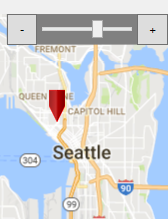

# CIOS Digital Flight Planner #

## Help ##
For flight operators who require an easy tool in generating flight plans for the Garmin G1000 integrated flight instrument system, the Flight Plan Editor is a tool that will allow flight operators to input locations with latitude/longitude coordinates to generate a flight path.
This program will allow flight operators to create flight plans in a comfortable manner opposed to using either the built-in editor in the G1000 or hand-creating plans using a text editor.

### New Flight Plan: ###
To create a new flight plan, first click on the ‘file’ tab located at the upper left window and select ‘new’.
User will be prompted to give the flight plan a name, and from there the user can add and edit waypoints as desired.
If there is another flight plan with the same given name, the user will be notified whether or not they would like to overwrite that current file or give the flight plan a different name.

### Save Flight Plan: ###
At any point, the user may save their current flight plan by click on the ‘file’ tab and selecting ‘save’.
This will save the current plan under its current name.
If the user wants to rename the file, instead choose ‘save as’ where the user will be prompted to give their file a new name.
As with creating a new flight plan, there will be a notification if there is a currently saved file under the same name and gives the user the option to overwrite or rename their file.

### Open Flight Plan: ###
Under the file tab selecting ‘open’ a user may load a previously saved flight plan.
Simply locate the file on the computer in order to access the flight plan, and from there the user may add and edit waypoints as desired.

### Add Waypoint: ###
Users may add waypoints in two different manners.
The first and recommended option is by typing in the coordinate location in both the latitude and longitude input boxes located on the left portion of the window.
Optionally a user can give each waypoint a unique ID, however this can be omitted and a default unique ID will be assigned.

In addition to the standard method of entry, a user may also right click at a point on the map and select 'add waypoint.'
At that particular location on the map, the waypoint will be added with the corresponding latitude and longitude.
In this step, the user is also given the option to name the waypoints ID if desired.

### Edit Waypoint: ###
As the user enters a series of waypoints, every newly added waypoint will be linked to the previous one which appears as a drawn line connecting the waypoints on the map.
Underneath the ID input boxes for adding a waypoint is a table of all waypoints and their position.
Find the waypoint in that table and click on the item to select it, and then there are options to either move the waypoint ‘move up’ or ‘move down’ the list to change the order in which waypoints are linked.

### Delete Waypoint: ###
To delete a waypoint, using the same table as the edit waypoints section, select the point to remove and click on the ‘delete’ tab located at the top left of the table.

### Using Map: ###
There are multiple controls to change the views for the map.
Since this map is using the Google maps API, please allow some time for the maps to load, this can take upwards of a minute or more depending on the computer and connection speed to the internet.
The following explains the controls:

For panning up and down, or side to side, hold the mouse click on-screen and drag the mouse in the opposite direction.
Please be patient and allow some time for the maps to download and refresh on screen if it does not immediately appear.

To zoom, in the upper right corner of the screen there are two buttons centered by a sliding bar.
As long as that slider is not set completely to the right or left side, the user may be able to zoom-in further by adjusting the slider or click on the ‘+’ symbol, or conversely use the ‘-‘ symbol to zoom out.

Located next to the left side panel in the upper portion of the map are a series of buttons for the topography of the map.
By clicking on one of them, a user can select between one of four different views: Roads, Terrain, Satellite, and Hybrid.
Only one view can be selected at a time, however users can freely change between these views without losing their current location on the map.

